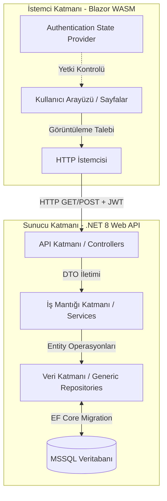

<div align="center">
  

  # Eray Gülüçmen - Modern Full-Stack Portfolio

  <p align="center">
    <strong>Gelişmiş .NET 8 & Blazor WebAssembly Mimarisi ile Hazırlanmış Dinamik Kişisel Portfolyo</strong>
  </p>

  <p align="center">
    <a href="https://github.com/ErGu14"></a>
    <a href="https://linkedin.com/in/eray-gulucmen-704b0a32a"></a>
    <a href="https://bionluk.com/kumanstack"></a>
  </p>

  <p align="center">
    
    
    
    
    
  </p>
</div>

<br />

## 📖 Proje Hakkında

Bu proje, bir yazılım geliştiricinin sahip olduğu yetenekleri, projelerini, sertifikalarını ve iletişim bilgilerini modern bir arayüz ile sergileyebilmesi için uçtan uca tasarlanmış **tam kapsamlı bir portfolyo sistemidir**. Proje, statik bir sayfadan ibaret olmayıp, arka planda çalışan güçlü bir **RESTful API** ve veritabanı destekli, tam teşekküllü bir **Admin Paneli** (İçerik Yönetim Sistemi) barındırmaktadır. 

Tüm site içerikleri (Yetenekler, Projeler, Hakkımda bilgileri, Sosyal medya linkleri vb.) admin paneli üzerinden anlık olarak (CRUD işlemleri ile) düzenlenebilmektedir.

---

## 🚀 Temel Özellikler

- **Dinamik İçerik Yönetimi:** Portfolyo üzerindeki yazılar, yetenekler, projeler, özellik kartları ve sertifikalar tamamen admin panelinden eklenebilir, silinebilir ve güncellenebilir.
- **Güvenli Kimlik Doğrulama:** ASP.NET Core Identity ve **JWT (JSON Web Token)** altyapısı kullanılarak güvenli giriş ve session (oturum) yönetimi. Sadece yetkili kişiler admin panele erişebilir.
- **Clean Architecture Prensibi:** Arka yüz (Backend), Service, Entity, Data ve API katmanlarına ayrılarak "Separation of Concerns" (Sorumlulukların Ayrılığı) prensibiyle kodlanmıştır.
- **Dependency Injection & Generic Repository:** Kod tekrarını sıfıra indiren, ölçeklenebilir ve test edilebilir mimari dizayn modeli (Pattern).
- **Responsive & Modern Arayüz:** Blazor WebAssembly üzerinde çalışan, CSS animasyonları, koyu tema destekli yapı ve Glassmorphism dokunuşlarıyla zenginleştirilmiş, tüm cihazlarla uyumlu tasarım.
- **Hazır Postman Koleksiyonu:** API'yi anında test edebilmeniz için tüm Body ve Auth yapılandırmalarının ayarlandığı, test script'leri yazılmış `PostmanCollection.json` mevcuttur.

---

## 🛠️ Teknoloji Yığını (Tech Stack)

### Backend (Sunucu Tarafı)
- **C# / .NET 8.0**
- **ASP.NET Core Web API**
- **Entity Framework Core 8** (Code-First Approach)
- **Microsoft SQL Server (MSSQL)**
- **ASP.NET Core Identity & JWT Bearer** (Kimlik doğrulama)
- **AutoMapper** (DTO eşleştirmeleri)
- **Swagger / OpenAPI** (API Dokümantasyonu)

### Frontend (İstemci Tarafı)
- **Blazor WebAssembly (.NET 8)**
- **Vanilla CSS3** (Responsive tasarım, Flexbox/Grid, Animasyonlar)
- **FontAwesome** (İkonlar)
- **SweetAlert2** (Kullanıcı dostu asenkron pop-up bildirimleri)
- **Microsoft.AspNetCore.Components.Authorization** (Arayüz yetkilendirmesi)

---

## 🏗️ Mimari Şeması



---

## 📦 Kurulum ve Çalıştırma

Projeyi yerel bilgisayarınızda (localhost) çalıştırmak için aşağıdaki adımları sırasıyla uygulayınız.

### 1. Gereksinimler
- [.NET 8.0 SDK](https://dotnet.microsoft.com/download/dotnet/8.0)
- SQL Server (Örn: SQL Server Express / Developer)
- Visual Studio 2022, Rider veya VS Code (C# Dev Kit eklentisi ile)

### 2. Projeyi Klonlayın
```bash
git clone https://github.com/ErGu14/Portfolyo.git
cd Portfolyo
```

### 3. Veritabanı Ayarları (Backend)
`Backend/PortfolioBackend/appsettings.json` veya `appsettings.Development.json` dosyalarını açın ve `DefaultConnection` bağlantı dizesini kendi SQL Server kurulumunuza göre düzenleyin.

Örnek:
```json
"ConnectionStrings": {
  "DefaultConnection": "Server=localhost\\SQLEXPRESS;Database=ErayPortfolioDb;Trusted_Connection=True;MultipleActiveResultSets=true;TrustServerCertificate=True"
}
```

### 4. Migration Çalıştırma ve Veritabanı Oluşturma
Package Manager Console üzerinden veya Terminalden Backend projesinin bulunduğu dizinde şu komutları çalıştırın:
```bash
cd Backend/PortfolioBackend
dotnet ef database update --project ../Data --startup-project .
```
*(Bu işlem, veritabanınızı oluşturacak ve varsayılan tabloları ve `Seed Data` olarak tanımlanmış örnek/ilk verileri (Örn: Admin hesabı, ilk projeler vb.) veritabanına basacaktır.)*

### 5. Projeyi Çalıştırma

Projeyi çalıştırmak için hem Backend hem de Frontend'in ayağa kaldırılması gerekir.

**Backend'i başlatmak için:**
```bash
cd Backend/PortfolioBackend
dotnet run
```

**Frontend'i başlatmak için:** *(Yeni bir terminal sekmesinde)*
```bash
cd Frontend/PortfolioFrontend
dotnet run
```

Artık tarayıcınızdan `http://localhost:5296` (veya belirtilen port) adresine giderek siteyi görebilir, `/login` sayfasına giderek veritabanında oluşturulan varsayılan yetkili bilgileriyle admin paneline girebilirsiniz.

> [!IMPORTANT]
> **Admin Giriş Bilgileri (Öğretmen Değerlendirmesi İçin)**
> - **E-Posta:** `eray@mail.com`
> - **Şifre:** `Admin123!*`

---

## 🧪 API Dokümantasyonu ve Postman

Backend projesi içerisinde uçtan uca test yapabilmeniz için profesyonel bir **Postman Koleksiyonu** oluşturulmuştur.
Projenin ana dizininde bulunan `PostmanCollection.json` dosyasını Postman uygulamasına doğrudan **Import** edebilirsiniz.

**Koleksiyonun Özellikleri:**
- Tüm CRUD (Get, Post, Put, Delete) işlemleri mevcuttur.
- Ekleme ve Güncelleme (`POST`, `PUT`) isteklerinin "Body" (gövde) kısımları, gerçekçi Dummy Data'lar ile önceden doldurulmuştur.
- `Auth/login` işlemi gerçekleştirildiğinde, dönen JWT Token **otomatik olarak** yakalanıp sisteme kaydedilir. Sonraki tüm isteklerde bu yetki anahtarı otomatik olarak kullanılır. (Manuel token kopyalamaya gerek yoktur!)

---

## 📂 Proje Dizin Yapısı

```text
Portfolyo/
├── Backend/
│   ├── Entity/            # Veritabanı tabloları, Modeller, DTO'lar (Data Transfer Objects)
│   ├── Data/              # DbContext, Migrations, Seed Veriler, Generic Repository
│   ├── Service/           # İş kuralları (Business Logic), AutoMapper Profilleri, Servis Yöneticileri
│   └── PortfolioBackend/  # Web API Controller'ları, Program.cs, JWT Ayarları
├── Frontend/
│   └── PortfolioFrontend/ # Blazor WebAssembly Projesi
│       ├── Components/    # Tekrar kullanılabilen UI bileşenleri (Hero, Projects, Contact vb.)
│       ├── Layout/        # MainLayout (Kullanıcı Arayüzü) ve AdminLayout (Yönetim Paneli)
│       ├── Pages/         # Görünüm Sayfaları ve Admin CRUD sayfaları
│       ├── Services/      # Backend API'sine istek atan HttpClient servisleri
│       └── wwwroot/       # Statik dosyalar, CSS, resimler
├── PostmanCollection.json # API Test Koleksiyonu
└── README.md              # Proje Dokümantasyonu
```

---

## 📜 Lisans

Bu proje **MIT Lisansı** altında lisanslanmıştır. Daha fazla detay için kodları inceleyebilir, kendi açık kaynak veya ticari projelerinizde kaynak göstererek kullanabilir ve özgürce değiştirebilirsiniz. 

```text
MIT License

Telif Hakkı (c) 2026 Eray Gülüçmen

Bu yazılımın ve ilgili belgelendirme dosyalarının ("Yazılım") bir kopyasını edinen 
herkese, Yazılımı kullanma, kopyalama, değiştirme, birleştirme, yayımlama, 
dağıtma, alt lisanslama ve/veya Yazılımın kopyalarını satma hakları da dahil 
olmak üzere, Yazılımı kısıtlama olmaksızın kullanma izni işbu belge ile 
ücretsiz olarak verilmektedir...
```

---

## 🔗 İletişim & Bağlantılar

Herhangi bir geri bildirim, iş birliği veya soru için benimle iletişime geçebilirsiniz. Fikirlerinizi duymaktan memnuniyet duyarım!

- **LinkedIn:** [Eray Gülüçmen](https://linkedin.com/in/eray-gulucmen-704b0a32a)
- **GitHub:** [ErGu14](https://github.com/ErGu14)
- **Freelance & Hizmetler:** [Bionluk (KumanStack)](https://bionluk.com/kumanstack)

<br/>

<div align="center">
  <sub><b>Portfolyo projesi temiz kod standartları ve modern mühendislik yaklaşımlarıyla geliştirilmiştir. 💻✨</b></sub>
</div>
